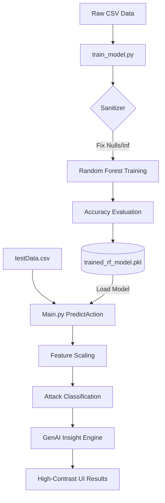

# 🛡️ CyberShield AI: Technical Workflow Architecture

## 1. Project Overview

**CyberShield AI** is an advanced network intrusion detection system (NIDS) that leverages **Random Forest Machine Learning** to predict and classify cyber attacks in real-time. It features a high-end "Liquid Glass" UI, a "Mathematical Sanitizer" for data reliability, and a simulated "GenAI Engine" for human-readable attack explanations.

---

## 2. Overall System Workflow (Step-by-Step)

1. **Authentication**: Users authenticate via `Main.py` (Flask) using a `users.json` repository.
2. **Dataset Acquisition**: The user selects the **Default (NSL-KDD)** baseline or uploads a **Custom CSV** via the Training Dashboard.
3. **Training Trigger**: The UI sends an AJAX request to `/TrainAction`, which invokes the `run_training()` function in `train_model.py`.
4. **Mathematical Sanitization**: The system automatically scans for `NaN` or `Infinity` values, converting them to `0` to prevent model crashes.
5. **Adaptive Learning**: The model identifies feature columns, encodes categorical data (like 'protocol_type'), and trains a **RandomForestClassifier**.
6. **Persistence**: The trained model, along with its scalers and label encoders, is saved into a compressed `model/trained_rf_model.pkl` file.
7. **Live Prediction**: On the Predict page, users upload a "Capture File" (`testData.csv`). The system loads the `.pkl` file, processes the new data identical to the training data, and outputs detection results.

---

## 3. Role of Core Components

### 📂 Training Files (`train_model.py` + `Dataset/*.csv`)

* **The Engine**: `train_model.py` handles the heavy lifting of data cleaning, splitting (Train/Test), and model optimization.
* **The Source**: `kdd_train.csv` provides the historical "Attack Patterns" that the AI studies to understand malicious behavior.

### 📂 Prediction Files (`Main.py` + `Dataset/testData.csv`)

* **The Brain**: `Main.py` manages the web routes and orchestrates the prediction logic.
* **The Input**: `testData.csv` represents "Live" network traffic that needs classification. It usually does not contain attack labels.

### 📂 Model Persistence (`model/trained_rf_model.pkl`)

* **The Memory**: This file is the bridge between Training and Prediction. It exports the "intelligence" of the model so the system doesn't have to re-learn every time a user wants a prediction.

### 📂 Jupyter Notebooks (`ipynb/*.ipynb`)

* **The Lab**: Files like `Final.ipynb` were used during the **Research & Development** phase. They allowed for rapid experimentation with accuracy metrics and algorithm selection before the logic was moved into the production Flask application.

---

## 4. Technical Data Flow

---

## 5. Why Re-train? (For Viva Prep)

* **Dataset Adaptation**: To make the AI understand a new dataset (like X-IIoTID).
* **Model Freshness**: To update the detection logic as new attack vectors are identified.
* **Verification**: To demonstrate the real-time processing capability to the examiner via the **Live Training Logs**.

---
**Documentation Version**: 2026.4  
**Project Lead**: Sreyan  
**Platform**: CyberShield AI Framework
