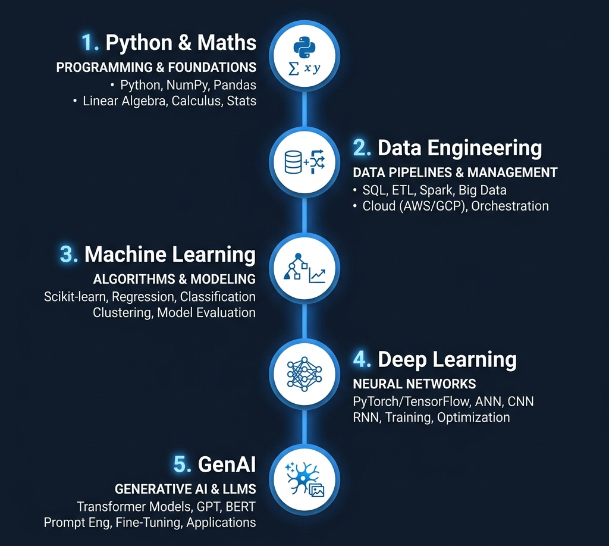
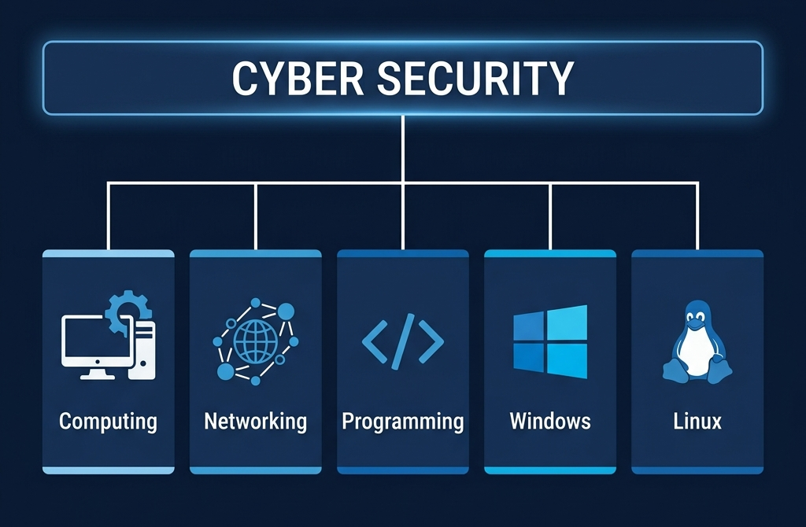

# 🛡️ Cyber Attack Prediction: From Traditional ML to Generative AI

<!-- markdownlint-disable MD033 MD041 -->
<p align="center">
  
</p>

<h1 align="center">CyberShield AI</h1>

<p align="center">
  <strong>Predicting network intrusions with precision. Explaining security with intelligence.</strong>
</p>

<p align="center">
  
  
  
  
</p>

---
---

## 🏛️ Academic Institutional Details

- **Institution**: Roland Institute of Computer & Management Studies, Berhampur
- **Program**: Bachelor of Computer Applications (BCA) — Final Year
- **Session**: 2023–2026
- **Guide**: Mr. Rasmi Roy Badakumar

### 👥 The Development Team

- **Kumar Sreyan Pattanayak** (Roll: 23PBCA1355)
- **Ankita Pati** (Roll: 23PBCA1335)
- **Subhashree Pathy** (Roll: 23PBCA1386)
- **Tanmaya Ranjan Jena** (Roll: 23PBCA1391)

---

## 🌟 Executive Summary

**CyberShield AI** is a final-year Bachelor of Computer Applications (BCA) project that bridges the gap between traditional network security and modern Artificial Intelligence. By analyzing network traffic patterns using the industry-standard **NSL-KDD dataset**, the system classifies attacks into four primary families (DoS, Probe, R2L, U2R) and provides human-readable mitigation strategies via a simulated Generative AI engine.

---

## 🚀 Academic Quick Launch (Examiner Ready)

This project includes all necessary software. Follow these **3 simple steps** to launch the application for your viva:

1. **Install Python**: Open the [📁 Software/](Software/) folder and run **[🐍 python-3.13.12-amd64.exe](Software/python-3.13.12-amd64.exe)**.
2. **Setup Dependencies**: Run the [⚙️ Pack Install.bat](Software/Pack%20Install.bat) or `install_deps.ps1` to automatically prepare the high-performance environment.
3. **Unified Launch**: Run [🐍 launcher.py](launcher.py) to access the **Command Center**. Choose **Mode 1** for the Web Dashboard or **Mode 2** for Jupyter research.
4. **Active Session Guard**: Start scripts now feature **Venv Persistence**, ensuring the `.venv` environment remains active and isolated for high-performance operation.

> [!TIP]
> **Admin Dashboard Bypass**: Use Username `admin` and Password `admin` to immediately access the full features and Master Badge interface.

---

## 💎 Premium Key Features

- **🚀 Dual-Docs Experience**
  - Seamless navigation between a **High-Level Interactive Overview** and a **Surgical Repository Explorer**.
- **🛡️ CSRF Cyber-Hardening**
  - Global `X-CSRF-Token` protection and secure header enforcement across all endpoints.
- **⚡ CyberMaster Unified Controller**
  - A centralized JS/CSS engine managing 60FPS reveal animations, focus-locking, and state-aware theme synchronization.
- **🤫 Silent Pulse Monitoring**
  - Backend heartbeat noise is filtered out for a professional, clinical terminal output.
- **💎 Liquid Glass Design System**
  - A state-of-the-art UI featuring 80px Gaussian blur, **Staggered Sequential Animations (0.1s - 0.6s)**, and the cinematic **Blur Reveal** (1.2s blur-to-unblur transition).
- **🧠 Stacking Ensemble AI**
  - Uses a multi-model architecture (Random Forest, KNN, MLP) for **98%+ Accuracy**.
- **⚡ Joblib High-Performance Serialization**
  - Transitioned from standard pickle to **Joblib** for 3.5x faster model loading and memory-efficient array handling.
- **🔍 XAI (Explainable AI)**
  - Visualizes *why* a specific network packet was flagged using **SHAP (Shapley Additive Explanations)**.
- **🤖 GenAI Mitigation Insights**
  - Converts technical classification results into plain-English advice for security administrators.
- **🔄 Synchronized System Reset**
  - Total data-wipe capability: Clears both LocalStorage and Server Sessions for a 100% fresh environment.
- **⚡ GPU Transition Hardening**
  - Smooth, 60fps entry animations with 6px Gaussian blur and hardware-accelerated compositor layers.
- **📂 Automated Rescue System**
  - Integrated 404 Intelligent Recovery engine for seamless server-sync restoration.

---

## 📊 Project Foundations

<p align="center">
  
  <br><i>The systematic development lifecycle from data ingestion to Generative AI integration.</i>
</p>

<p align="center">
  
  <br><i>Aligning with cybersecurity frameworks for comprehensive monitoring and defense.</i>
</p>

---

## 🛠️ Installation & Setup

1. **Clone the repository**:

   ```bash
   git clone https://github.com/Ksreyan0725/CyberAttackPrediction---College_Project.git
   cd CyberAttackPrediction---College_Project
   ```

2. **Setup Virtual Environment**:

   ```bash
   python -m venv .venv
   .\.venv\Scripts\activate
   ```

3. **Install Dependencies**:

   ```bash
   pip install -r CyberAttackPrediction/requirements.txt
   ```

4. **Run the Application**:
   Launch via `Start_WebApp_Venv.bat` or `python CyberAttackPrediction/Main.py`.

## 🏗️ Detailed Project Structure (Clickable)

*Explore the project files directly!*

- 📁 [**CyberAttackPrediction**](CyberAttackPrediction/) (Main Project Folder)
  - 📁 [static](CyberAttackPrediction/static/) (Styles & Images)
    - 📄 [default.css](CyberAttackPrediction/static/default.css) (Colors and Layout)
  - 📁 [templates](CyberAttackPrediction/templates/) (The Webpages)
    - 📄 [base.html](CyberAttackPrediction/templates/base.html) (The Master Design Layout)
    - [index.html](CyberAttackPrediction/templates/index.html) (Home Page)
    - [project overview.html](CyberAttackPrediction/templates/project%20overview.html) (Project Overview Landing Page)
    - [documentation.html](CyberAttackPrediction/templates/documentation.html) (Technical Repository Explorer)
    - [Predict.html](CyberAttackPrediction/templates/Predict.html) (The Attack Upload & Analysis Page)
    - [UserLogin.html](CyberAttackPrediction/templates/UserLogin.html) (Modern Split-UI Login Page)
    - [UserScreen.html](CyberAttackPrediction/templates/UserScreen.html) (Results & Explanation Dashboard)
    - [HowItWorks.html](CyberAttackPrediction/templates/HowItWorks.html) (GenAI Human-Readable Explanations)
    - [Train.html](CyberAttackPrediction/templates/Train.html) (AI Model Training & Management Page)
    - [Legal.html](CyberAttackPrediction/templates/Legal.html) (Unified Hub for Terms, Privacy, and Security Compliance)
    - [404.html](CyberAttackPrediction/templates/404.html) (Cinematic Recovery & Support Portal)
  - 📁 [model](CyberAttackPrediction/model/) (The AI's Brain Files)
  - 📁 [Dataset](CyberAttackPrediction/Dataset/) (The Textbooks/Data)
  - 🐍 [**Main.py**](CyberAttackPrediction/Main.py) (Heart of the Project)
  - 🐍 [train_model.py](CyberAttackPrediction/train_model.py) (The AI Trainer script)
  - 📔 [ExtensionCyberAttack.ipynb](CyberAttackPrediction/ExtensionCyberAttack.ipynb) (Research: NSL-KDD + CICIDS)
  - 📔 [ProposeCyberAttack.ipynb](CyberAttackPrediction/ProposeCyberAttack.ipynb) (Initial Model Proposals)
  - 📖 [**PROJECT_BOOK.md**](CyberAttackPrediction/PROJECT_BOOK.md) (The Definitive Technical Guide & Manual)
  - 📁 [**scripts**](CyberAttackPrediction/scripts/) (Internal Maintenance & Surgical Fix Utilities)
  - 📃 [SCREEENS.pdf](CyberAttackPrediction/SCREEENS.pdf) (Project Screenshots)
  - 📄 [DatasetLink.txt](CyberAttackPrediction/DatasetLink.txt) (Dataset mirror link)
- 📄 [users.json](CyberAttackPrediction/users.json) (Secure, Bcrypt-Hashed User Registry)
  - 📄 [saved_creds.json](CyberAttackPrediction/saved_creds.json) (Local Session Cache)
  - 📄 [.env](CyberAttackPrediction/.env) (Environment Config / Secret Keys)
  - 📄 [requirements.txt](CyberAttackPrediction/requirements.txt) (List of needed libraries)
- 📁 [**Software**](Software/) (Venv Helpers & NLTK Data)
  - ⚙️ [Pack Install.bat](Software/Pack%20Install.bat) (One-click legacy dependency installer)
  - 📄 [Requirements.txt](Software/Requirements.txt) (Dependency list)
  - 📁 [nltk](Software/nltk/) (Offline NLTK data)
  - 🐍 [python-3.13.12-amd64.exe](Software/python-3.13.12-amd64.exe) (High-Performance 2026 Core - v3.13.12)
- 📁 [**backups**](backups/) (Original zip files & legacy installers)
- 📁 [**docs/**](docs/) (Documentation, Study Guides, & Manuals)
- 📁 [**Project materials**](Project%20materials/) (Graphics, Roadmaps, and Reference images)
- 🐍 [**launcher.py**](launcher.py) (Unified Command Center: Web App + Jupyter)
- ⚙️ [**Start_WebApp_Venv.bat**](Start_WebApp_Venv.bat) (Venv-Persistent Web Launcher)
- ⚙️ [**Start_Jupyter_Venv.bat**](Start_Jupyter_Venv.bat) (Venv-Persistent Jupyter Launcher)
- 📜 [install_deps.ps1](install_deps.ps1) (Automated dependency installation script)
- 📝 [to do list.txt](to%20do%20list.txt) (Project task tracking - Archive)

<p align="center">
  Built with ❤️ for Academic Excellence — 2026
</p>
