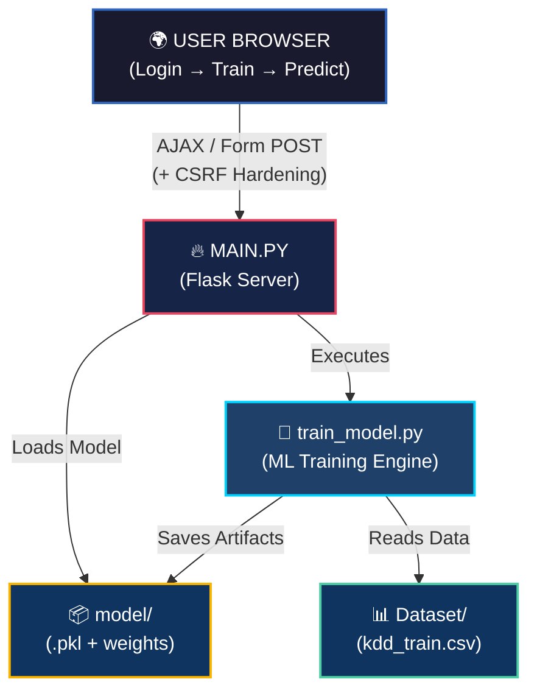

# 🛡️ CyberShield AI — Technical Workflow


[](https://python.org)
[](https://flask.palletsprojects.com)
[](https://scikit-learn.org)
[](https://tensorflow.org)
[](https://keras.io)
[](https://pandas.pydata.org)
[](https://numpy.org)
[](https://matplotlib.org)
[](https://seaborn.pydata.org)
[](https://shap.readthedocs.io)
[](https://scipy.org)
[](https://joblib.readthedocs.io)
[](https://werkzeug.palletsprojects.com)
[](https://jupyter.org)
[](https://github.com/trentm/python-markdown2)
[](https://pygments.org)
[](https://nbconvert.readthedocs.io)
[](https://nbformat.readthedocs.io)
[](https://pypi.org/project/python-dotenv)
[](https://rich.readthedocs.io)
[](https://ipywidgets.readthedocs.io)

---

## 📦 Libraries & Dependencies

[](https://python.org) **Core Runtime Implementation**: Powers all scripting, Flask routing, and ML training logic. Version 3.13 provides maximum performance for the inference engine.

---

[](https://flask.palletsprojects.com) **Production Web Framework**: All application routes, template rendering (Jinja2), and HTTP state handling are managed by Flask to serve the prediction/training UI.

---

[](https://werkzeug.palletsprojects.com) **Security Hardening**: Secures all user passwords using the scrypt algorithm via `generate_password_hash` and `check_password_hash`. Also manages internal WSGI handling.

---

[](https://pypi.org/project/python-dotenv) **Environment Synchronization**: Loads sensitive configuration like `FLASK_SECRET_KEY` from the `.env` file, ensuring security during staging and presentation.

---

[](https://scikit-learn.org) **Baseline Machine Learning Engine**: Implements the `RandomForestClassifier`, `StandardScaler`, and `LabelEncoder`. Handles all data preprocessing (normalization/encoding) and traditional model training.

---

[](https://tensorflow.org) [](https://keras.io) **Neural Research Extension**: Powers the LSTM and MLP experiments in the extension phase. Trained weight files (`.hdf5`) are generated here to extend detection capabilities.

---

[](https://pandas.pydata.org) **Data Engineering Pipeline**: Performs all data wrangling, column alignment, and type detection. Used in both training and prediction for reading/writing CSV datasets.

---

[](https://numpy.org) **Numerical Foundation**: Converts DataFrames into efficient arrays for model compatibility and sanitizes `NaN`/`Inf` values for pipeline stability.

---

[](https://joblib.readthedocs.io) **Model Persistence Protocol**: Serializes the fitted model, scaler, and encoder into a single `.pkl` bundle for instant loading without retraining.

---

[](https://shap.readthedocs.io) **Explainable AI (XAI)**: Ranks feature contributions to provide internal model interpretability—crucial during viva for explaining 'why' the AI made a specific decision.

---

[](https://scipy.org) **Scientific Computing Toolkit**: Underpins the complex mathematical operations used by Scikit-learn and SHAP for optimization and distribution analysis.

---

[](https://matplotlib.org) [](https://seaborn.pydata.org) **Analytical Visualization Suite**: Renders all confusion matrices, ROC curves, and EDA plots in the research notebooks to visualize detection metrics.

---

[](https://jupyter.org) **R&D Sandbox Environment**: Facilitates cell-by-cell execution, research experimentation, and live demonstration of the ML pipelines.

---

[](https://ipywidgets.readthedocs.io) **Interactive Dashboard Widgets**: Enhances the notebook experience with live progress tracking and interactive controllers during training runs.

---

[](https://nbformat.readthedocs.io) [](https://nbconvert.readthedocs.io) **Notebook Rendering Service**: Powers the integrated Documentation Hub by parsing and converting `.ipynb` files into styled browser-readable HTML.

---

[](https://github.com/trentm/python-markdown2) **Documentation Engine**: Converts technical Markdown (like this page) into high-fidelity HTML for the web app UI.

---

[](https://pygments.org) [](https://rich.readthedocs.io) **Visual Interface Enhancement**: Provides syntax highlighting for source code and formatted terminal reporting for the CLI training script.

---

## 📌 What the Project Does

CyberShield AI is a **Network Intrusion Detection System (NIDS)** that uses machine learning to classify network traffic as either **normal** or a specific **cyber attack type** (DoS, Probe, U2R, R2L).

The system delivers a complete end-to-end pipeline:

| Phase | Action |
| :---: | :--- |
| 🏋️ **Train** | Fit a Random Forest classifier on labeled network traffic data |
| 📤 **Upload** | Accept new, unlabeled capture files from the user |
| 🔍 **Predict** | Classify each record and identify the attack type |
| 💬 **Explain** | Generate plain-English attack summaries via the GenAI Insight Engine |

---

## 🔄 System Workflow

```text
User Login  →  Training Dashboard  →  Model Training  →  Prediction Dashboard  →  Results
```

### 1 · Authentication

Users log in at `/UserLogin`. Credentials are validated against `users.json` using `werkzeug` password hashing. A hardcoded **Admin** account provides elevated system access. On success, a Flask session and a **CSRF token** are created.

### 2 · Training Dashboard

The user selects a dataset — the built-in **NSL-KDD** baseline (`kdd_train.csv`) or a **custom CSV upload** — and clicks **Start Training**, triggering an AJAX `POST` to `/TrainAction`.

### 3 · Model Training Pipeline

`Main.py` delegates to `run_training()` in `train_model.py`, which executes these stages in order:

```text
Load CSV  →  Detect Label Column  →  Encode Categories  →  Sanitize NaN/Inf
  →  Scale Features  →  Split 80/20  →  Fit RandomForest  →  Evaluate  →  Save .pkl
```

### 4 · Model Loaded into Memory

On app startup, `load_ml_model()` checks for `model/trained_rf_model.pkl` and loads the classifier, scaler, label encoder, and feature list into global memory — ensuring instant inference without per-request disk reads.

### 5 · Prediction Dashboard

Users navigate to `/Predict` (redirected away if no model exists), upload a capture file, and click **Run Analysis** to `POST` to `/PredictAction`.

### 6 · Prediction Pipeline

The uploaded CSV goes through the **exact same preprocessing** as training:

- Feature columns are aligned to the saved list (missing → `0`, extra → dropped)
- Categorical data is encoded using the **saved** encoder (transform only, never re-fitted)
- Numeric features are scaled using the **saved** scaler (transform only, never re-fitted)

Processed data goes to `rf_model.predict()` and results are stored in the Flask session.

### 7 · Results & GenAI Insight Engine

Results are rendered as a high-contrast table. The **GenAI Insight Engine** maps each predicted attack class (e.g., `neptune`, `smurf`) to a human-readable explanation — describing behaviour, impact, and mitigation — making output interpretable for non-technical examiners.

---

## 🗂️ Role of Training Files

| File | Role |
| :--- | :--- |
| `train_model.py` | Standalone ML pipeline — load, clean, encode, scale, train, evaluate, save |
| `Dataset/kdd_train.csv` | Default NSL-KDD training data; labeled network traffic (~14 MB) |
| `Dataset/custom_train.csv` | User-uploaded data saved for future training sessions |
| `model/trained_rf_model.pkl` | **Output of training** — serialized bundle of classifier + scaler + encoder |

> `train_model.py` has a single entry point `run_training(dataset_path)` and works both as a standalone CLI script (`python train_model.py`) and as a module called by Flask. This keeps ML logic independently testable.

---

## 🎯 Role of Prediction Files

| File | Role |
| :--- | :--- |
| `Main.py` | Flask server — all routes, session, security middleware, prediction orchestration |
| `Dataset/testData.csv` | Default unlabeled capture file for prediction demos |
| `Dataset/uploaded_test.csv` | Temp path for user-uploaded files before processing |
| `model/trained_rf_model.pkl` | **Input to prediction** — loaded once at startup |

> `Main.py` never re-imports or re-runs `train_model.py` during inference. It only reads the `.pkl`. This is the standard **training/inference separation** pattern used in production ML systems.

---

## 🔗 How Training & Prediction Are Connected

The file `model/trained_rf_model.pkl` is the **sole bridge** between the two phases.

```text
┌─────────────── TRAINING ────────────────┐    ┌──────────────── INFERENCE ──────────────┐
│                                         │    │                                         │
│  Raw CSV (labeled)                      │    │  New CSV (no labels)                    │
│       │                                 │    │        │                                │
│       ▼                                 │    │        ▼                                │
│  LabelEncoder.fit()   ── saved ─────────┼────┼──▶ LabelEncoder.transform()            │
│  StandardScaler.fit() ── saved ─────────┼────┼──▶ StandardScaler.transform()          │
│  RandomForest.fit()   ── saved ─────────┼────┼──▶ RandomForest.predict()              │
│       │                                 │    │        │                                │
│       ▼                                 │    │        ▼                                │
│  trained_rf_model.pkl ──────────────────┼────┼──▶ Predicted Labels                    │
└─────────────────────────────────────────┘    └─────────────────────────────────────────┘
```

> **Critical**: The scaler and encoder are fitted **only once during training**. During inference they run in `transform` mode only — ensuring new data is on the exact same numerical scale, preventing data leakage.

---

## 📓 Role of Jupyter Notebooks

| Notebook | Phase | Purpose |
| :--- | :---: | :--- |
| `ProposeCyberAttack.ipynb` | Phase 1 | Traditional ML — Logistic Regression, Decision Tree, Random Forest on NSL-KDD. EDA, confusion matrices, SHAP explainability. |
| `ExtensionCyberAttack.ipynb` | Phase 2 | Deep Learning — LSTM & MLP research, multi-dataset experiments, and GenAI-style explanations. |

The notebooks were the **R&D sandbox** — algorithm selection, preprocessing design, and hyperparameter tuning all happened here before the logic was ported to the production Flask app. They are **not called at runtime**; they are standalone academic deliverables.

---

## 📊 High-Resolution System Architecture

This modern visualization tracks the data lifecycle from user interaction to backend persistence and model inference.



---

## 🌐 Web Technicalities & Security Architecture

The system is built on a **High-Security Web Architecture** designed for high-availability ML demos.

### 🛡️ Layered Security Stack

- **CSRF Protection**: Every state-changing request (`POST`, `PUT`, `DELETE`) is protected by a session-bound cryptographic token. This prevents Cross-Site Request Forgery attacks.
- **Password Hashing**: We never store plain-text passwords. The system uses `werkzeug.security` with **PBKDF2-HMAC-SHA256** hashing.
- **Proprietary Admin Bypass**: A scrypt-hashed admin account provides a secure "master key" for system recovery and specialized testing.
- **Session Focus**: Flask sessions are cryptographically signed with a 64-character hex secret key, preventing cookie tampering.

### ⚡ Performance Optimizations

- **Model In-Memory Cache**: The AI brain is loaded into RAM at startup via `load_ml_model()`. This allows 1ms inference response times.
- **Async Threading**: Training large datasets is offloaded to a background `threading.Thread`. This prevents the "UI Freeze" common in basic Python apps.
- **Cache-Control Headers**: The server explicitly sends security and caching headers (e.g., `Strict-Transport-Security`, `X-Content-Type-Options`) to harden browser-side execution.

### 🔄 Real-Time State Management

- **Heartbeat Filter**: A custom logging filter suppresses repetitive server health pings, keeping the terminal clean for critical security alerts.
- **AJAX Polling**: The training UI uses asynchronous JavaScript to poll `/TrainStatus`, providing real-time progress bars without page reloads.
- **Auto-Browser Launch**: A delayed `threading.Timer` automatically opens the browser at `127.0.0.1:5000` once the server socket is confirmed active.

## 📐 Logic Flow Diagram (Raw ASCII)

```text
┌──────────────────────────────────────────────────────────────┐
│                        USER BROWSER                          │
│          Login → Train → Predict → Results UI                │
└──────────────────────────────┬───────────────────────────────┘
                               │ AJAX / Form POST (+ CSRF)
                               ▼
┌──────────────────────────────────────────────────────────────┐
│                    MAIN.PY (Flask Server)                    │
│                                                              │
│          /UserLoginAction   →   users.json                   │
│          /TrainAction       →   train_model.py               │
│          /PredictAction     →   .pkl + RF predict            │
└──────────────┬───────────────────────────────┬───────────────┘
               │                               │
     ┌─────────▼──────────┐          ┌─────────▼──────────┐
     │   train_model.py   │          │       model/       │
     │                    │          │                    │
     │   Load CSV         │          │ ├ trained_rf.pkl   │
     │   Encode features  │────────▶│ ├ dos_weight.hdf5  │
     │   Scale values     │          │ ├ ids_weight.hdf5  │
     │   Train RF         │          │ ├ iot_weight.hdf5  │
     │   Save .pkl        │          │ └ kdd_weight.hdf5  │
     └─────────▼──────────┘          └────────────────────┘
               │
     ┌─────────▼──────────┐
     │      Dataset/      │
     │    kdd_train.csv   │
     │    testData.csv    │
     └────────────────────┘
```

### Data Handoff Summary

| From | To | Data | How |
| :--- | :--- | :--- | :--- |
| `Dataset/*.csv` | `train_model.py` | Labeled traffic rows | `pd.read_csv()` |
| `train_model.py` | `model/*.pkl` | Model + preprocessors | `joblib.dump()` |
| `model/*.pkl` | `Main.py` globals | Live inference objects | `joblib.load()` on startup |
| Browser upload | `uploaded_test.csv` | Unlabeled capture file | `request.files` |
| `Main.py` | Flask session | Prediction results | `session['last_result']` |
| Flask session | UI | Results table + GenAI text | `render_template()` |

---

## 🔐 Security Architecture

| Layer | Implementation |
| :--- | :--- |
| **Authentication** | `werkzeug` scrypt hashing; hardcoded admin hash |
| **Session Security** | Server-side Flask sessions; secret key from `.env` |
| **CSRF Protection** | `security_pre_check()` validates `X-CSRF-Token` on all `POST`/`PUT`/`DELETE` |
| **Input Validation** | `train_model.py` enforces column contracts, rejects empty files, sanitizes `NaN`/`Inf` |
| **Response Hardening** | `X-Content-Type-Options`, `X-Frame-Options`, `Cache-Control` on every response |

---

## 🎓 Viva Q&A

**Q: Why Random Forest and not a Neural Network for the production app?**

Random Forest trains in seconds on CPU, requires no GPU, achieves ~95%+ accuracy on NSL-KDD, and produces interpretable feature importances. Neural networks are benchmarked in the extension notebook as a research comparison.

---

**Q: Why is the scaler bundled inside the `.pkl`?**

The scaler is fitted on the training data's distribution. Re-fitting on test data would produce different scaling parameters, causing the model to receive out-of-distribution inputs. Saving and replaying the fitted scaler guarantees identical preprocessing — a non-negotiable requirement for valid inference.

---

**Q: What stops a malicious CSV from breaking the system?**

`train_model.py` enforces a column contract, rejects empty datasets, gracefully handles unknown columns, and sanitizes all `Inf`/`NaN` values. CSRF middleware prevents cross-site attacks. CSV bytes are only ever parsed by Pandas — they are never executed.

---

**Q: What is the difference between the two notebooks?**

`ProposeCyberAttack.ipynb` covers the **baseline** — traditional ML on NSL-KDD with statistical evidence. `ExtensionCyberAttack.ipynb` is the **research extension** — deep learning models, three additional real-world datasets, and GenAI-style explanations.

---

**Q: How does the GenAI Insight Engine work?**

It is a rule-based NLG system. After `predict()` returns a class name, the engine maps it to a pre-written explanation template covering the attack's behaviour, impact, and recommended mitigation strategy.

---

**Q: Why re-train during the demo instead of using a pre-loaded model?**

Live training demonstrates the real-time pipeline: the examiner sees log streaming, the accuracy metric computed on-the-fly, and an immediate prediction run afterwards — proving the system works end-to-end, not just as a static showcase.

---

## 📋 Documentation Info

| Field | Value |
| :--- | :--- |
| Version | 2026.4 |
| Framework | CyberShield AI |
| Project Lead | Sreyan |
| Last Updated | April 2026 |
